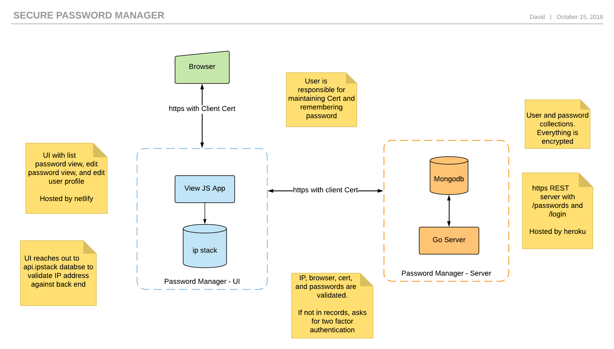

# password manager ui
UI for safely storing and managing encrypted passwords. For the backend see [password manager service](https://github.com/dgoldstein1/passwordmanagerservice)



# Development

### Requirements

The following software must be installed before loading up the project.

- [docker cli](https://docs.docker.com/install)
- [node](https://nodejs.org/en/download/)

Currently the following operating systems are tested and supported

- OS X 10.13 High Sierra
- Ubuntu 18
- Pop!OS 17

### Setting up the Project

Clone project

```sh
git clone git@github.com:dgoldstein1/password-manager-ui.git
```

#### Launch the Project

```sh
# start docker
docker-compose up -d
# see if all containers are up
docker-compose ps
```

Open https://localhost:8080 to see the app running.

### Developemnt

Any changes to source code are automatically applied to the the docker container serving the app.

### Deployment

Develop and Master are automatically deployed on merge.

# Testing

```sh
npm test
```

## Authors

* **David Goldstein** - [DavidCharlesGoldstein.com](http://www.davidcharlesgoldstein.com/?github-password-manager-ui) - [Decipher Technology Studios](http://deciphernow.com/)

## License

This project is licensed under the MIT License - see the [LICENSE.md](LICENSE.md) file for details
